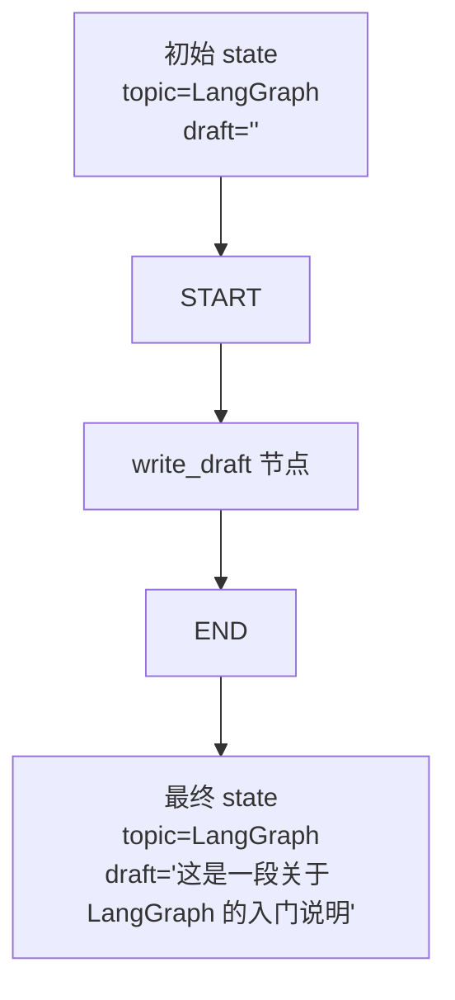
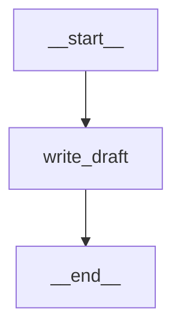

# 第 1 课：最小 LangGraph 到底跑了什么

运行：

```bash
uv run python examples/01_hello_graph.py
```

你看到的不是“AI 回答”，而是 LangGraph 最小工作流：



如果你只看 LangGraph 自己的节点和边，它是这张图：



代码里可以直接打印这张图：

```python
print(app.get_graph().draw_ascii())
print(app.get_graph().draw_mermaid())
```

`draw_ascii()` 适合在终端看，`draw_mermaid()` 适合放进 Markdown 文档渲染。

## 每个对象代表什么

`State`

表示整张图共享的数据。第一课里它只有两个字段：

```python
topic: str
draft: str
```

意思是：这个工作流运行期间，状态里必须有 `topic` 和 `draft`。

`write_draft`

这是一个节点。节点就是普通函数：

```python
def write_draft(state: State) -> dict:
    return {"draft": "..."}
```

它读取 `state["topic"]`，然后返回新的 `draft`。

重点是：它没有返回完整 state，只返回了要更新的字段。

`StateGraph(State)`

创建一张图，并告诉 LangGraph：这张图的状态结构是 `State`。

`add_node`

把一个 Python 函数注册成图里的节点。

`add_edge`

定义执行顺序。

第一课的顺序是：

```text
START -> write_draft -> END
```

这就是“图”的核心：节点是要执行的函数，边是函数之间的执行方向。

`compile`

把“图定义”变成“可运行对象”。

`invoke`

真正运行这张图。

## 执行结果代表什么

输入：

```python
{"topic": "LangGraph", "draft": ""}
```

节点返回：

```python
{"draft": "这是一段关于「LangGraph」的入门说明。"}
```

最终输出：

```python
{"topic": "LangGraph", "draft": "这是一段关于「LangGraph」的入门说明。"}
```

这证明 LangGraph 做了两件事：

1. 按边的顺序执行节点。
2. 把节点返回的 partial update 合并进 state。

## 你应该动手改 3 次

第 1 次：把输入主题改成 `"AI Agent"`，观察 `draft` 是否变化。

第 2 次：给 `State` 增加一个字段：

```python
audience: str
```

然后让 `write_draft` 根据 `audience` 生成不同内容。

第 3 次：新增一个节点 `polish_draft`：

```text
START -> write_draft -> polish_draft -> END
```

这时你就从“一个节点”进入了“多步骤工作流”。
